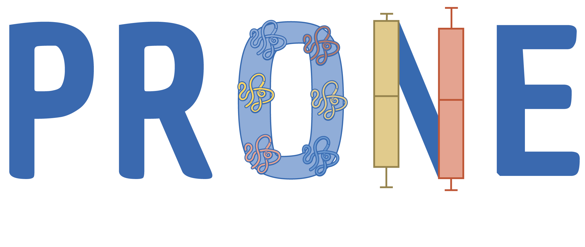

# PRONE.Shiny 

R Shiny App of the R Package PRONE

## Introduction

Latest, high-throughput technologies, such as DNA microarrays or mass spectrometry, have made substantial advancements in several ways, including instrument detection accuracy and data generation speed. These developments result in massive amounts of information-rich transcriptomics, proteomics, and metabolomics data. However, high-throughput OMICs data frequently comprise systematic biases introduced throughout various steps of a clinical study, from biological sample collection to quantification. Neglecting these biases could result in erroneous conclusions drawn from quantitative analysis.
 
Data pre-processing techniques, in particular, normalization of data post-acquisition, aim to account for these biases and improve sample comparability. There are several approaches for processing and normalizing OMICs data generally and mass spectrometry (MS)-based proteomics data specifically. However, since the origin of these biases is usually unknown, selecting an appropriate normalization technique for a given dataset is challenging. 

## R Shiny App PRONE

Here, we present PRONE, a user-friendly R package that comes with a Shiny app that employs state-of-the-art normalization methods and enables simple evaluation of normalization methods through both quantitative and qualitative evaluation metrics and DE analysis. 

A detailed description of the PRONE package that is also useful for navigation through the Shiny app is available [here](https://lisiarend.github.io/PRONE.R/).

There are three possibilities to run the R Shiny app PRONE:

### Public Web Interface

The public web interface is available at [https://exbio.wzw.tum.de/prone/](https://exbio.wzw.tum.de/prone/). 

Currently, the docker image [lisiarend/prone.shiny:v0.0.1](https://hub.docker.com/layers/lisiarend/prone.shiny/v0.0.1/images/sha256-5175a29c9c6e34e7c1bfd677816d8cc30be085aff263a5b43c4e9f2c0ac6965b?context=repo) is running.

### Docker Image

Additionally, a docker image for our shiny app is publicly available on Docker Hub. First, make sure docker is installed on your machine. Then run

``` bash
docker pull lisiarend/prone.shiny:latest

# OR for a specific version

docker pull lisiarend/prone.shiny:v0.0.1 
```

You can run the app in a single container using

``` bash
docker run --rm -p 3838:3838 lisiarend/prone.shiny:latest

# OR for a specific version

docker run --rm -p 3838:3838 lisiarend/prone.shiny:v0.0.1

```

If you go to localhost:3838, you can see our Shiny app.

### Run App Locally

You can also run the Shiny App in your R session with `shiny::runApp()`.
In that case, you have to restore the project library using
[renv](https://rstudio.github.io/renv/articles/renv.html):

``` r
# install.packages('renv')
renv::restore()
```

## Citation

If you are using either the R package or the Shiny app, please cite the following paper: TODO

## Issues

If you have difficulties using PRONE, please open an issue.

